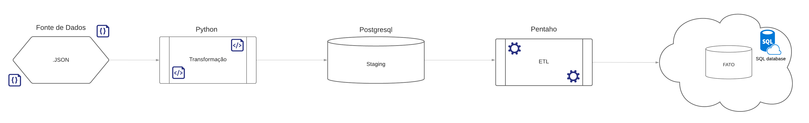

# Sistema de ETL com CEPs do Brasil
Esse projeto faz o tratamento de dados a partir de uma base de dados JSON com amostras de CEPs do Brasil todo,
envia para a tabela Staging em um banco de dados postgresql desenvolvido em ambiente linux na Cloud Azure,
com a utilização da ferramenta Pentaho Data Integration é feito o carregamento desses dados, o filtro e o envio para as tabelas que serão consumidas
pelas aplicações.

O foco desse projeto foi desenvolver um pipeline completo para estruturar um sistema ETL que dimensiona e organiza os dados,
de forma que ao final do fluxo eles estejam automatizados, tratados e prontos para serem consumidos.

### Requisitos:
- Instalar o Python3
- Instalar as bibliotecas pandas, JSON, sqlalchemy, dotenv, os
- Banco de Dados Postgresql 12 ou versão superior
- Pentaho Data Integration
- JRE e JDK do Java 8 ou versão superior

### Estrutura de pasta:
```
.
│   .gitignore
│   cep.json
│   README.md
│   tratamento_cep.py
│
└───env
        .env
```

### Fluxo do Pipeline


### Pentaho Data Integration


### Considerações finais:
- **@Desenvolvedor:** Mateus Santos de Jesus
- **@Linkedin:** https://www.linkedin.com/in/mateus-santos-de-jesus-9819a8186